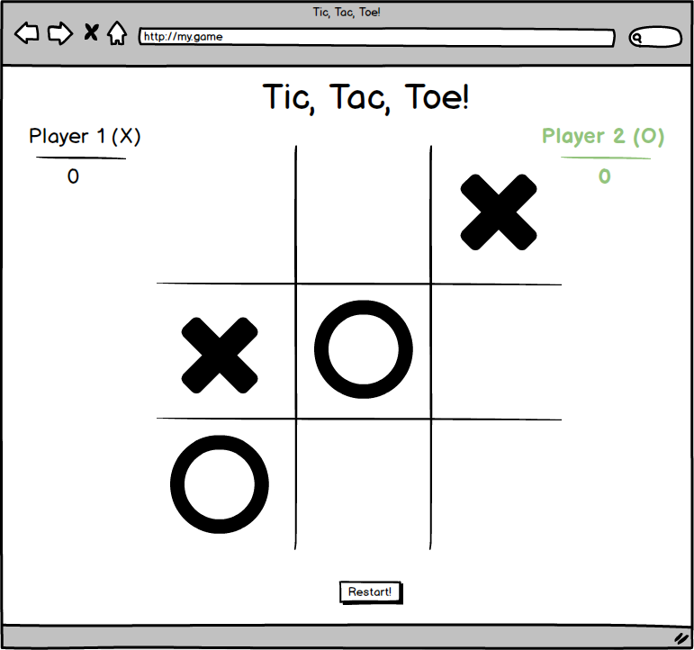

# Simple Tic Tac Toe App

This is a simple tic tac toe app that I created with Angular 7.
Below I have included a simple mock that I created in balsamiq of what I am going for. 

Each time the next player's turn is up, their side of the board will change to green.  Once they select the position on the board they want to choose, the turn will move to the other player untill the game is won or tied.

